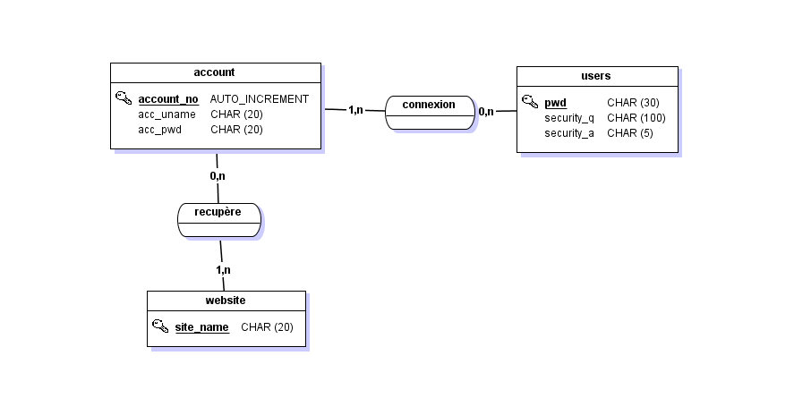

---
title: "Rapport de projet: Logiciel de gestion de mots de passe"
author: Clément PELLEAU
date: "2021-01-29"
...
## Préambule

Ce rapport est le résultat du travail réalisé pendant l’unité d’enseignement UTC504 : Systèmes d’Information et bases de données.

L'idée de ce projet m'est venu quand j'ai voulu comprendre le fonctionnement d'un gestionnaire de mots de passe. En ayant une impédance pour la sécurité informatique, j'ai créer ce projet afin de lier cette UTC ce domaine. C'est un projet que je ferrai évoluer au fil du temps en rajoutant des fonctionnalités supplémentaires sur mon temps libre dans le but d'en faire mon gestionnaire de mots de passe, quand celui-ci sera suffisamment évolué et sécurisé.


## Cahier des charges

### Expression du besoin

Mettre en place un gestionnaire de mots de passe permettant de sauvegarder des mots de passe au sein d'une base de données et ainsi éviter l'utilisation de mots de passe similaires sur plusieurs sites.

Ce projet est évolutif, l'ensemble de la solution ne pourra pas être développée dans le temps imparti.

### Spécification fonctionnelles

Les fonctionnalités qui vont suivre sont celles qui seront implémentées à la fin de l'UE :

- connexion à la plateforme via un mots de passe maître;
- sauvegarde des mots de passe au sein d'une base de données;

- interface gestion des mots de passe enregistrés sur la plateforme;

- administration via l’invite de commande.

Fonctionnalités futures :

- chiffrement de la base de données;
- générateur de mots de passe avec critères;
- mot de passe maître chiffré et salé;
- copie automatique du mot de passe dans le clipboard.

Pour des raisons de portabilité et de légèreté, l'application sera développé en python et utilisera une base de données SQLite.


Insérer lien git


## Merise : démarche d’analyse et modèles associés

### Dictionnaire de données

Cette application nécessite 3 entités :

\-    account : Pour la gestion des identifiants enregistrés sur la plateforme.

\-    website : qui stockera l’ensemble des sites internet enregistré sur la plateforme et qui sera liée à la entité account.

\-     users : Pour la gestion du compte de déverrouillage de la plateforme.

| **Champs :  account** | **Type**       | **Commentaire**          | **Contrainte** |
| --------------------- | -------------- | ------------------------ | -------------- |
| account_no            | AUTO_INCREMENT | N° séquentiel            | Identifiant    |
| acc_uname             | CHAR(20)       | Pseudo ou  email du site |                |
| acc_pwd               | CHAR(20)       | Mot de passe  du site    |                |

| **Champs :  website** | **Type** | **Commentaire**       | **Contrainte** |
| --------------------- | -------- | --------------------- | -------------- |
| Site_name             | CHAR(20) | Nom du site renseigné | Identifiant    |

| **Champs : users** | **Type**  | **Commentaire**                   | **Contrainte** |
| ------------------ | --------- | --------------------------------- | -------------- |
| pwd                | CHAR(30)  | Mot de passe maître               | Identifiant    |
| security_q         | CHAR(100) | Question de sécurité              |                |
| security_a         | CHAR(50)  | Réponse à la question de sécurité |                |

 ### Modèle Conceptuel de données (MCD)

Le MCD permet de schématiser la structure des tables de la base de données. Ce modèle contient les informations saisies dans le dictionnaire de données.

Voici le MCD obtenu à partir des informations décrites précédemment.



### Requête SQL de création de la base de données SQLite


```sqlite
drop table if exists users;
drop table if exists website;
drop table if exists account;

PRAGMA foreign_keys = ON;

create table users (
    pwd             char(30),
    security_q      char(100),
    security_a      char(50),
    primary key (pwd)
);
create table website (
    site_name       char(20),
    primary key (site_name)
);
create table account (
    account_no      int,
    acc_uname       char(20),
    acc_pwd         char(20),
    site_name       char(20),
    foreign key (site_name) references website,
    primary key (account_no)
);
```

## Diagrammes UML

### Introduction

Le language UML (Unified Modeling Language) a été pensé pour être un langage de modélisation visuelle commun. Il est destiné à la conception et la mise en œuvre de systèmes logiciels complexes par leur structure ou par leur comportement.

Dans le cadre du projet, nous avons réaliser deux diagrammes (un diagramme de séquence et un diagramme d'utilisation), permettant de concevoir l'application.

### Diagramme de séquence

Diagramme de séquences permet de représenter graphiquement les interactions entre les acteurs et le système selon un ordre chronologique.

Nous allons utiliser ce diagramme pour comprendre les interactions avec le programme et la base de données.


### Diagramme d'utilisation

Le diagramme de cas d'utilisation permet, comme son nom l'indique, d'expliciter comment un système ou un objet technique est utilisé.

Ci-dessous le diagramme d'utilisation de notre application en corrélation avec les besoins exprimé dans le cahier des charges.


### Détail du code

Fonction qui permet de se connecter à la BDD

```python
def connect(database):
    global connection, cursor
    # Connexion à la BDD SQLite
    connection = sqlite3.connect(database)
    cursor = connection.cursor()
    return
```

Fonction vérification si un utilisateur est créer dans la BDD. Si l'utilisateur n'est pas créé, on le setup grâce à la fonction account.

```python
def login():
    global connection, cursor
    # Vérifie si un compte est créé dans la BDD
    cursor.execute("SELECT * FROM users;")
    account = cursor.fetchone()
    if account == None: # Pas de compte crée
        account_setup()
    else:
        correct_pass = password_verification()
        if correct_pass == False:
            verified = security_verification()
            if verified == False:
                reset()
                account_setup()
    options()
    return
```

Fonction account_setup, permet de créer le mot de passe maître et la question de sécurité dans la BDD.

```python
def account_setup():
    global connection, cursor
    # Interface Reset Password
    print("Gestion mot de passe maître")
    notMatch = True
    while notMatch:
        password = getpass("Nouveau mot de passe: ")
        password2 = getpass("Retaper votre mot de passe: ")
        if password == password2:
            notMatch = False
        else:
            print("Password incorrect, réessayer")
    security_q = input("question de sécurité: ")
    security_a = input("réponse à la question: ")
    account_info = (password, security_q, security_a)
    cursor.execute("INSERT INTO users VALUES (?, ?, ?);", account_info)
    connection.commit()
    print("Votre compte est à présent crée !")
    return
```

Fonction password_verification permet de vérifier si le mot de passe maître est bon. Si le mot de passe n'est pas bon, l'utilisateur possède 3 tentatives

```python
def password_verification():
    global connection, cursor
    # Check si l'utilisateur à rentré le bon mot de passe
    verified = False
    attempts = 3    # Nombre de tentative
    failedAttempts = 0
    while verified == False and failedAttempts != attempts:
        password = getpass("Entrer votre mot de passe: ")  
        cursor.execute("SELECT * FROM users WHERE pwd = ?;", (password,))
        user_info = cursor.fetchone()
        if user_info == None:   # Mot de passe incorrect
            failedAttempts += 1
            left = attempts-failedAttempts
            word = "essais"
            if left == 1:
                word = "essai"
            print("Votre mot de passe est incorrect, vous avez", str(left), word, "restant")
        else:
            verified = True
    return verified
```

Cette fonction permet de vérifier si la question de sécurité est correct. Elle intervient à la suite de 3 tentatives incorrect de mot de passe. L'utilisateur possède ensuite 3 tentatives, si celle-ci sont infructueuses on réinitialise la BDD avec la fonction reset

```python
def security_verification():
    global connection, cursor
    # Check si la question de sécurité est valide
    verified = False
    print("Répondre à la question de sécurité pour accéder au compte")
    cursor.execute("SELECT security_q, security_a FROM users;")
    data = cursor.fetchone()
    question = data[0].lower()
    answer = data[1].lower()
    attempts = 3
    failedAttempts = 0
    while verified == False and failedAttempts != attempts:
        user_answer = input(question + ": ")
        if user_answer == answer:
            print("La réponse est correct")
            verified = True
        else:
            print("La réponse est incorrect")
            failedAttempts += 1
            left = attempts-failedAttempts
            word = "essais"
            if left == 1:
                word = "essai"
            print("Mot de passe invalide, il vous reste", str(left), word, "restant")
    return verified
```

Fonction reset, permet de supprimer les données de la BDD en cas de tentatives infructueuses (plus d'essais de mot de passe et question sécurité).

```python
def reset():
    global connection, cursor
    # Supprime toutes les données dans la database
    cursor.execute("DELETE FROM users;")
    cursor.execute("DELETE FROM website;")
    cursor.execute("DELETE FROM account;")
    connection.commit()
    print("Le programme a été rénitialisé")
    return
```

Fonction qui affiche les menus du programmes.

```python
def options():
    # Menu des options
    print('''
            1. quitter
            2. gestion du mot de passe maître
            3. Voir les comptes
            4. Ajouter un compte
        ''')
    notValid = True
    while notValid:
        option = input("Choissisez une option: ")
        try:
            option = int(option)
            if option in range(1, 5):
                notValid = False
            else:
                print("Option invalide")
        except:
            print("Option invalide")
    if option == 1:
        quit()
    elif option == 2:
        settings()
    elif option == 3:
        view_accounts()
    else:
        site_name = input("Ajouter un compte pour le site internet: ").lower()
        add_account(site_name)
    return
```

Fonction qui affiche les paramètres de gestion du compte maître.

```python
def settings():
    # Paramètres des options
    print('''
            1. Revenir au menu
            2. Changer le mot de passe
            3. Changer la question de sécurité
            4. Rénitialiser
        ''')
    notValid = True
    while notValid:
        option = input("Choissisez une option: ")
        try:
            option = int(option)
            if option in range(1, 5):
                notValid = False
            else:
                print("Option invalide")
        except:
            print("Option invalide")
    if option == 1:
        options()
    elif option == 2:
        reset_manager_password()
    elif option == 3:
        reset_manager_question()
    else:
        reset()
    return
```

Fonction pour réinitialiser le mot de passe maître.

```python
def reset_manager_password():
    global connection, cursor
    # Changer un mot de passe dejà defini dans la BDD
    print("Configurer un nouveau mot de passe")
    notMatch = True
    while notMatch:
        password1 = getpass("Nouveau mot de passe: ")
        password2 = getpass("Retaper votre mot de passe: ")
        if password1 == password2:
            notMatch = False
        else:
            print("Le mot de passe ne correspond pas, réessayer")
    new_password = (password1,)
    cursor.execute("UPDATE users SET pwd = ?;", new_password)   # Mise à jour du nouveau mot de passe
    connection.commit()
    print("mot de passe mis à jour !")
    settings()
    return
```

reset_manager_question permet de réinitialiser la question de sécurité permettant de déverrouiller le compte.

```python
def reset_manager_question():
    global connection, cursor
    print("Configurer une nouvelle question de sécurité")
    question = input("Question de sécurité: ")
    notMatch = True
    while notMatch:
        answer1 = input("Réponse: ")
        answer2 = input("Retaper la réponse: ")
        if answer1 == answer2:
            notMatch = False
        else:
            print("La réponse ne correspond pas, réessayer")
    new_info = (question, answer1)
    cursor.execute("UPDATE users SET security_q = ?, security_a = ?;", new_info)   # Mise à jour de la nouvelle question de sécurité
    connection.commit()
    print("La question de sécurité à été mis à jour")
    settings()
    return
```

view_accounts() cette fonction permet de voir les comptes auxquels l'utilisateur à enregistrer un mot de passe.

```python
def view_accounts():
    global connection, cursor
    # Affiche les mots de passe de l'utilisateur
    print("Vos comptes pour lesquels vous avez enregistré des mots de passe")
    cursor.execute("SELECT site_name FROM website;")
    site_data = cursor.fetchall()
    print('''
            1. Menu principale''')
    adjust = 2  # Nombre d'option disponible
    max_option = len(site_data) + adjust
    for x in range(adjust, max_option):
        site = site_data[x-adjust][0].lower()
        print('''           ''', str(x) + ". " + site)
    print()
    notValid = True
    while notValid:
        option = input("option: ")
        try:
            option = int(option)
            if option in range(1, max_option):
                notValid = False
        except:
            print("Option invalide")
    if option == 1:
        options()
    else:   # Affiche infos du site
        index = option - adjust
        site = site_data[index][0].lower()
        all_accounts(site)
    return
```

all_accounts cette fonction permet de visualiser les comptes associés au site enregistré.

```python
def all_accounts(site_name):
    global connection, cursor
    # Permet de visualiser les comptes associés au site
    #site_name - nom du site à récuperer les infos
    cursor.execute("SELECT account_no, acc_uname, acc_pwd FROM account WHERE lower(site_name) = ?;", (site_name,))
    account_info = cursor.fetchall()
    # Plusieurs comptes peuvent être associés à un site
    print("Vos comptes associés au site", site_name)
    count = 1
    for account in account_info:
        uname = account[1]
        pwd = account[2]
        print(count, "- " * 15)
        print("email/username:", uname)
        print("mot de passe:", pwd)
        count += 1
    print("\ncommands: option - numéro du compte | 'QUIT' pour revenir au menu | 'add' pour ajouter un compte")
    print("options: u - mettre à jour le mot de passe | d - supprimer le compte")
    notValid = True
    while notValid:
        command = input("Entrer une commande: ").replace(" ", "")
        if command == "QUIT":
            view_accounts()
        if command == "add":
            add_account(site_name)
        commands = command.split("-")
        if len(commands) == 2:
            option = commands[0].lower()
            acc_num = commands[1]
            if option == "u" or option == "d" or option == "a":
                try:
                    acc_num = int(acc_num) - 1  # On commande l'indexing à partir de 1
                    if acc_num in range(0, len(account_info)):
                        notValid = False
                except:
                    print("Option invalide")
            else:
                print("Option invalide")
        else:
            print("Option invalide")
    account_to_change = account_info[acc_num]
    if option == "u":
        update_account(account_to_change)
    if option == "d":
        delete_account(account_to_change)
    view_accounts()
```

update_account : Cette fonction permet de mettre à jour un compte utilisateur dans la BDD.

```python
def update_account(account):
    global connection, cursor
    # Mets à jour le compte de l'utilisateur( username et mot de passe)
    print('''
        1. Changer votre email/username
        2. Changer votre mot de passe
        3. quitter''')
    account_no = account[0]
    exit = False
    # Continue à demander à l'utilisateur d'entrer une option jusqu'a qu'il choisisse de quitter
    while not exit:
        notValid = True
        while notValid:
            option = input("option: ")
            try:
                option = int(option)
                if option in range(1, 4):
                    notValid = False
                else:
                    print("Option invalide")
            except:
                print("Option invalide")
        if option == 1:
            username = input("Entrer votre username/email: ")
            new_info = (username, account_no)
            cursor.execute("UPDATE account SET acc_uname = ? WHERE account_no = ?;", new_info)
            connection.commit()
            print("email/username a été mise à jour")
        elif option == 2:
            password = input("enter new password: ")
            new_info = (password, account_no)
            cursor.execute("UPDATE account SET acc_pwd = ? WHERE account_no = ?;", new_info)
            connection.commit()
            print("mot de passe a été mise à jour")
        else:
            exit = True
    return
```

delete_account : Cette fonction permet de supprimer un compte dans la BDD.

```python
def delete_account(account):
    global connection, cursor
    # Supprime un compte dans la base de données
    account_no = account[0]
    cursor.execute("DELETE FROM account WHERE account_no = ?;", (account_no,))
    connection.commit()
    print("Compte supprimé")
    return
```

add_account : Cette fonction permet d'ajouter un compte au sein de la BDD.

```python
def add_account(site_name):
    global connection, cursor
    # Ajoute un compte et génère un numero de compte unique avant de l'insérer dans la BDD. On continu de demander à l'utilisateur d'entrer une option jusqu'a qu'il quitte.
    cursor.execute("SELECT site_name FROM website WHERE lower(site_name) = ?;", (site_name,))
    site_info = cursor.fetchone()
    # Ajoute un site web à la BDD si il n'existe pas
    if site_info == None:
        print("Nouveau site ajouté dans la BDD")
        cursor.execute("INSERT INTO website VALUES (?);", (site_name,))
        connection.commit()
    uname = input("email/username: ")
    password = input("mot de passe: ")
    notValid = True
    while notValid:
        decision = input("Ajouter le compte (y/n)? ").lower()
        if decision == "y" or decision == "n":
            notValid = False
        else:
            print("Entrer invalide")
    if decision == "y":
        # Génère un numero de compte aléatoire et l'insert dans la BDD
        cursor.execute("SELECT account_no FROM account;")
        info = cursor.fetchall()
        allNo = []
        for num in info:
            allNo.append(num[0])
        accNo = random.randint(0, 1000)
        while accNo in allNo:
            accNo = random.randint(0, 1000)
        account_info = (accNo, uname, password, site_name)
        cursor.execute("INSERT INTO account VALUES (?, ?, ?, ?);", account_info)
        connection.commit()
        print("Compte ajouté")
    else:
        print("Compte non ajouté")
    options()
    return
```

main() : Cette fonction, est la fonction principale du programme, c'est elle qui appelle toutes les autres fonctions.

```python
# Connexion à la BDD
def main():
    global connection, cursor
    database = "./pwd-mgr.db"
    connect(database)
    login()
    connection.commit()
    connection.close()

if __name__ == "__main__":
    main()
```

## Conclusion

Ce projet m'aura permis de mettre en œuvre toutes les connaissances acquises lors de l'UTC 504, au sein d'un projet stimulant et utile. Étant passionné de sécurité informatique, comprendre le fonctionnement d'un gestionnaire de mots de passe en réalisant son propre gestionnaire, est très intéressant et enrichissant. Et je compte améliorer celui-ci au fil du temps sur mon temps libre.
